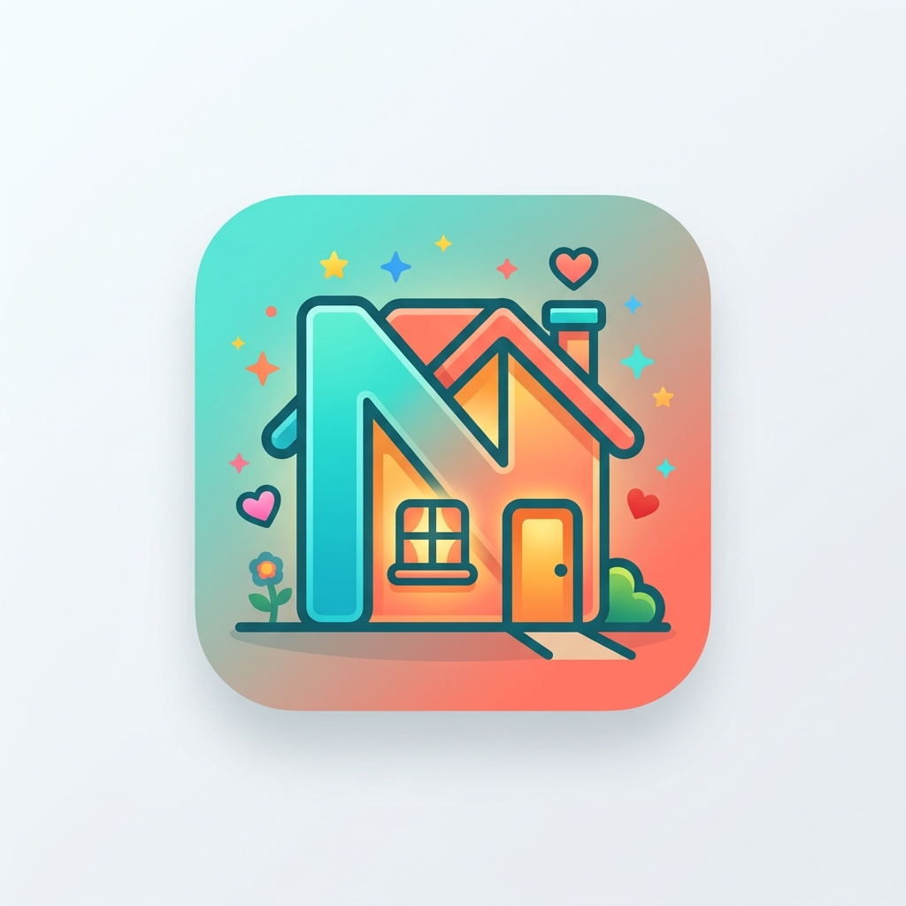

<div align="center">



# Nexo — Family Hub

**A shared family tablet app for chores, points & rewards.**  
Built with React 19, Vite, Tailwind CSS v4 & Framer Motion. Installable as a PWA.


</div>

---

## What is Nexo?

Nexo is a family task & rewards app designed to live on a **shared tablet** in a common area (like the kitchen). Any family member can walk up, check their chores, mark them as completed, and earn XP points. Parents can manage tasks, members, and rewards from the same device.

### How it works

1. **Admins** (parents) create the Family Group and add members, tasks, and rewards.
2. The tablet stays in a shared space — no individual logins needed.
3. Each family member **taps their tasks** to mark them complete → earns XP.
4. XP can be **redeemed in the Rewards Store** for real-life prizes (movie night, pizza, extra screen time).

---

## Features

| Screen | Description |
|---|---|
| 🏠 **Dashboard** | Daily overview — member progress bars, XP leaderboard, upcoming events |
| 📅 **Calendar** | Monthly family calendar with event dots, detail panel & upcoming events sidebar |
| ✅ **Chores** | 3-column board (one per member) with time slots — tap to complete with confirmation modal |
| 🏆 **Rewards** | XP store — select who's redeeming, see what you can afford, confirm with modal |
| ⚙️ **Manage** | Admin panel — CRUD for members, tasks, and rewards |

### Highlights

- **Tablet-first UX** — bottom navigation bar, large touch targets (min 48×48px), no 300ms tap delay
- **Completion modal** — "Is this you, Diana? 👋" confirmation before marking a task done
- **Confetti burst** 🎉 animation on task completion
- **Framer Motion** throughout — spring animations, animated progress bars, smooth modals
- **PWA ready** — installable on iPad/Android tablet, works offline via Service Worker
- **Safe area aware** — supports notch and home bar on modern tablets

---

## Tech Stack

- **React 19** with React Compiler
- **TypeScript 6**
- **Vite 8** + `vite-plugin-pwa` (Workbox)
- **Tailwind CSS v4** (`@tailwindcss/vite`)
- **Framer Motion** for animations
- **Zustand** for global state (with `persist` middleware)
- **React Router v7**
- **React Icons** (Lucide set)
- **Supabase** (client configured — backend integration in progress)

---

## Getting Started

### Prerequisites

- Node.js ≥ 20
- pnpm ≥ 9

### Install & run

```bash
# Install dependencies
pnpm install

# Start dev server
pnpm dev
```

Open [http://localhost:5173](http://localhost:5173) in your browser.

### Build for production

```bash
pnpm build
```

### Preview production build

```bash
pnpm preview
```

---

## Project Structure

```
nexo/
├── public/
│   ├── favicon.svg
│   └── icon-512.png          # PWA app icon
├── src/
│   ├── components/
│   │   ├── AppHeader.tsx      # Top header: greeting, progress, XP chips
│   │   ├── BottomNavBar.tsx   # Tablet bottom navigation (5 tabs)
│   │   ├── Dashboard.tsx      # Home screen — progress cards & leaderboard
│   │   ├── FamilyCalendar.tsx # Monthly calendar with events
│   │   ├── FamilyManagement.tsx # Admin CRUD panel
│   │   ├── Layout.tsx         # App shell (header + content + bottom nav)
│   │   ├── RewardsStore.tsx   # XP rewards catalog & redeem flow
│   │   └── TaskBoard.tsx      # Chores board with completion modal
│   ├── store/
│   │   └── useFamilyStore.ts  # Zustand store (members, tasks, rewards)
│   ├── lib/
│   │   └── supabaseClient.ts  # Supabase client
│   ├── AppRouter.tsx
│   ├── main.tsx
│   └── index.css              # Tailwind v4 theme + tablet CSS
├── vite.config.ts             # Vite + PWA config
└── index.html                 # PWA meta tags
```

---

## Roles

| Role | Permissions |
|---|---|
| **Admin** | Create/edit/delete members, tasks & rewards; access the Manage panel |
| **Member** | Complete their assigned tasks; redeem rewards with their XP balance |

---

## Installing as PWA

### iPad / iPhone
1. Open Safari → navigate to the app URL
2. Tap the **Share** button → **Add to Home Screen**
3. Launch from the home screen — it runs in standalone landscape mode

### Android Tablet
1. Open Chrome → navigate to the app URL
2. Tap the **⋮ menu** → **Add to Home Screen** (or **Install App**)
3. Launch from the home screen

---

## Roadmap

- [ ] Supabase backend — persist family groups, members, tasks, rewards
- [ ] Authentication — family group login with Supabase Auth
- [ ] Admin PIN — protect the Manage panel with a 4-digit PIN
- [ ] Push notifications — daily chore reminders
- [ ] Weekly summary — XP earned each week, streak tracking
- [ ] Add event form — create calendar events from within the app
- [ ] Recurring tasks — set chores that reset daily/weekly automatically
- [ ] Multi-family support — one account, multiple family groups

---

## License

MIT © Mario Caceres
